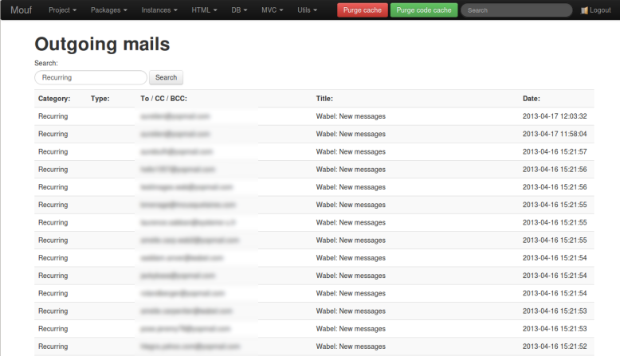
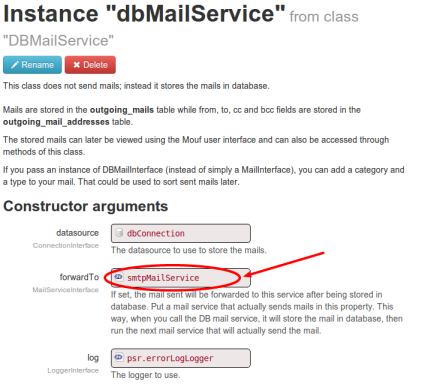

Mouf's DBMailService
====================

Storing outgoing mails
----------------------

In Mouf, *emails* are sent using *MailServices*.<br/>
This package contains a mailer that does not send any mail! Instead, it stores the mail to
be sent in a database table. The DB mailer can also forward the mail to a real mailer that will indeed send the mail (usually a [**SmtpMailService**](http://mouf-php.com/packages/mouf/utils.mailer.smtp-mail-service/README.md))

Mails are stored in the `outgoing_mails` table while "from", "to", "cc" and "bcc" fields are stored in the 
`outgoing_mail_addresses` table.
The stored mails can later be viewed using Mouf's user interface and can also be accessed through methods of this class.



This UI is great in a development process, when you want to actually see what your application is sending 
without actually sending the mail, but is also very useful in production, in order to be able to verify
what mails your application is sending. 

Installing DBMailService
------------------------

There is an install process for this package. It will create a database patch. Once you have run the install process,
you will need to install the patch.

The patch will create 2 tables if they are not alreay there: <strong>outgoing_mails</strong> and <strong>outgoing_mail_addresses</strong>.

The install process will also create a *dbMailService* instance that will be connected to the current
*dbConnection* (if it exists) and will use the *mailService* instance to actually send the mail.

Usage sample
------------

You use this service as you would use any MailService.


For instance, to send a mail, you just need to write:

```php
$mailService = Mouf::getDBMailService();

$mail = new Mail();
$mail->setBodyText("This is my mail!");
$mail->setBodyHtml("This is my &lt;b&gt;mail&lt;/b&gt;!");
$mail->setFrom(new MailAddress("my@server.com", "Server"));
$mail->addToRecipient(new MailAddress("david@email.com", "David"));
$mail->setTitle("My mail");

$mailService->send($mail);
```

Additional features
-------------------

If you pass an instance of `DBMail` (or any class implementing `DBMailInterface`) to the `send` method
of the service, you can add an additionnal category and a type to your mail.
That could be used to sort sent mails later.

Here is a modified sample using `DBMail`. 

```php
$mailService = Mouf::getDBMailService();

$mail = new DBMail();
$mail->setBodyText("This is my mail!");
$mail->setBodyHtml("This is my &lt;b&gt;mail&lt;/b&gt;!");
$mail->setFrom(new MailAddress("my@server.com", "Server"));
$mail->addToRecipient(new MailAddress("david@email.com", "David"));
$mail->setTitle("My mail");

// Let's set the category
$mail->setCategory("My category");

// Let's set the type
$mail->setType("My type");

$mailService->send($mail);
```

Accessing the sent mails database
---------------------------------

You can access the sent mails database directly from the Mouf administration interface.
You just need to click on the **Utils** menu and click the **View outgoing mails** submenu.


As you can see in the screenshot, you can view the list of sent mails. A full-text search box will search
the whole outgoing mails.

Forwarding mails
----------------

The `DBMailService` is very useful because it stores the mails in database.
Obviously, you can use it for debugging purposes. However, most of the time, you will want
to store the mail in database AND send it. For this, the `DBMailService` can **forward** the
mail to another mail service. You just need to edit the Mouf's instance of the service and set the
forward service:


